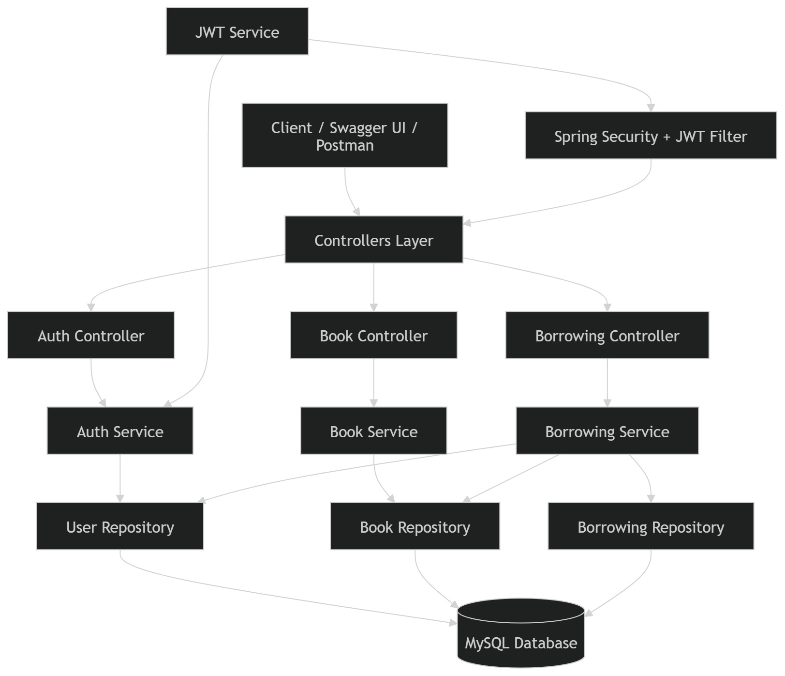
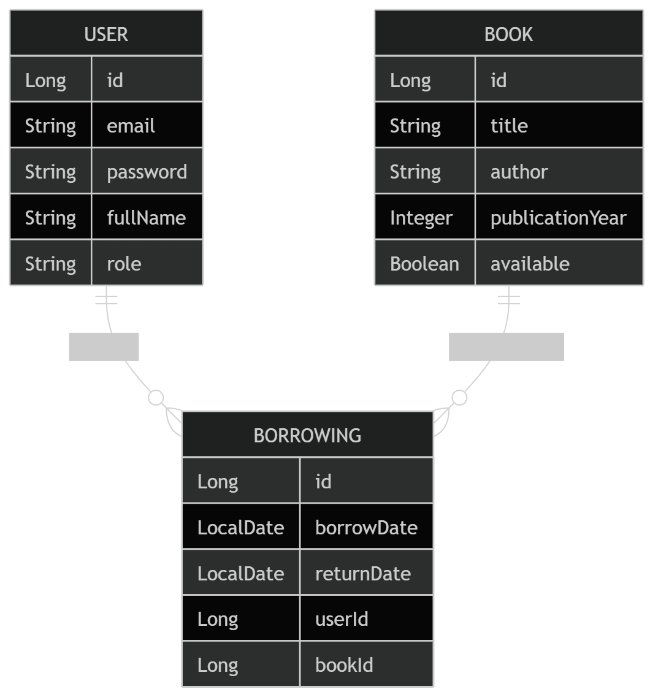
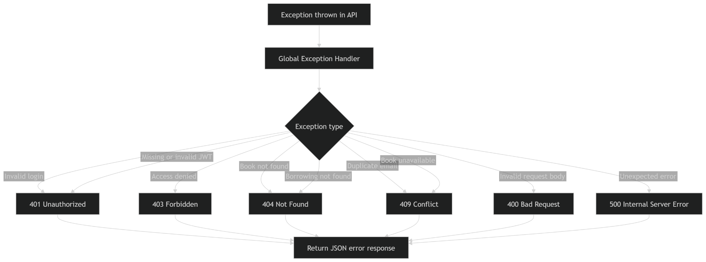
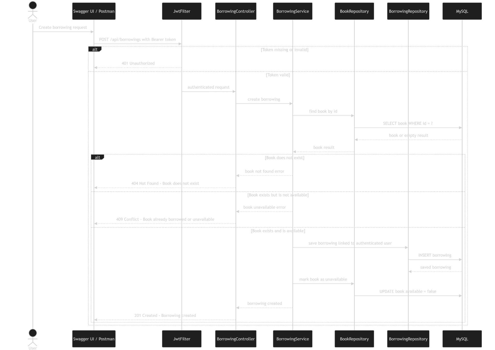
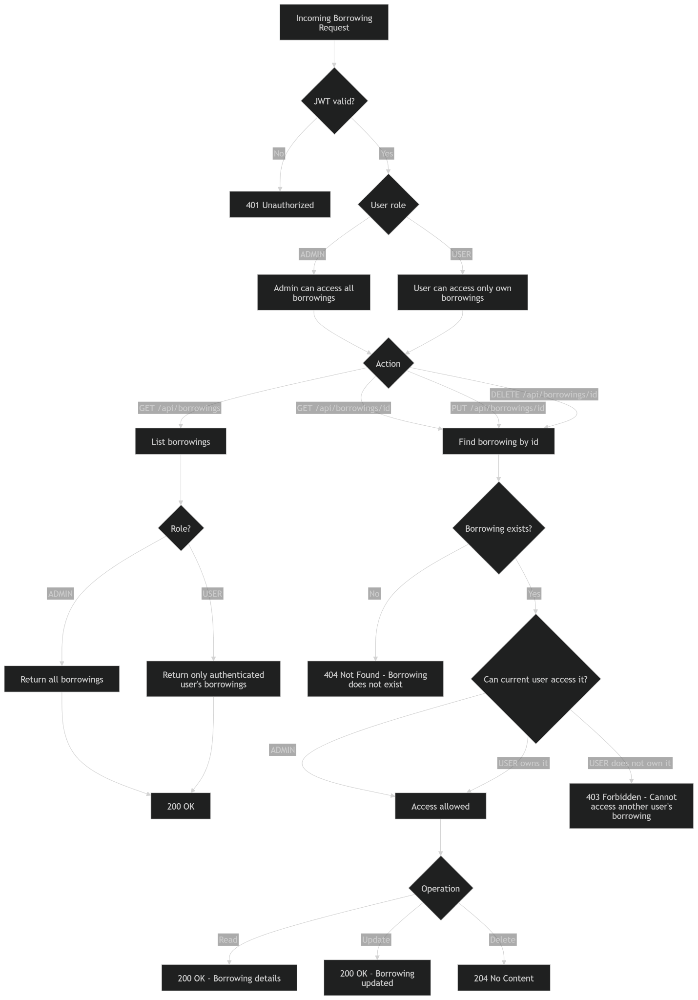
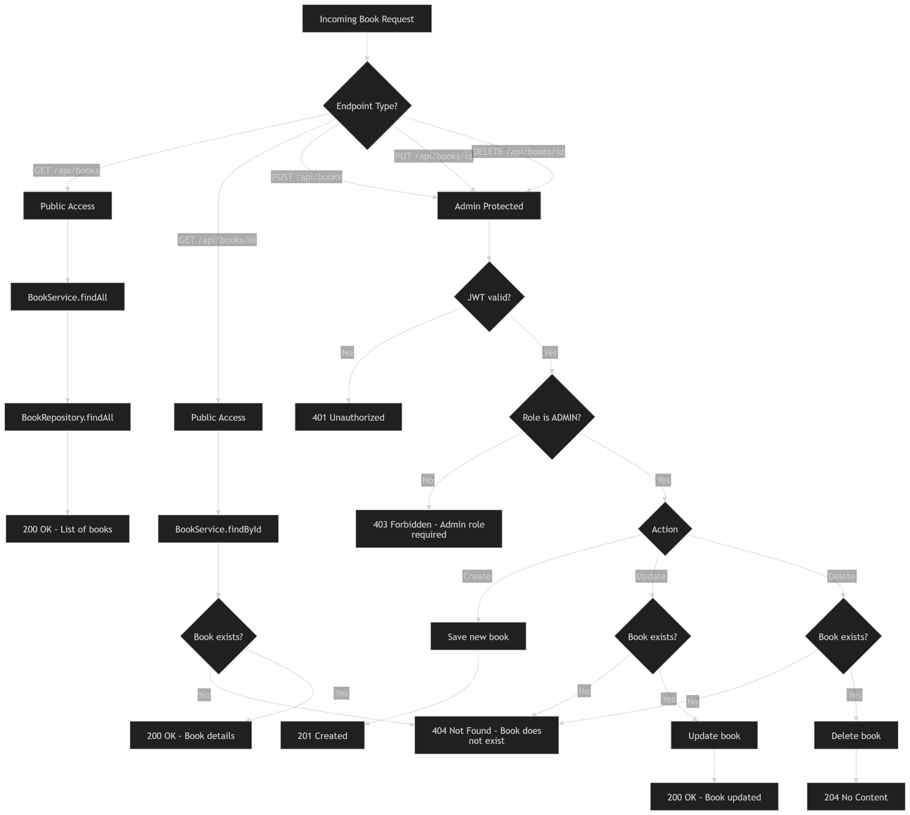
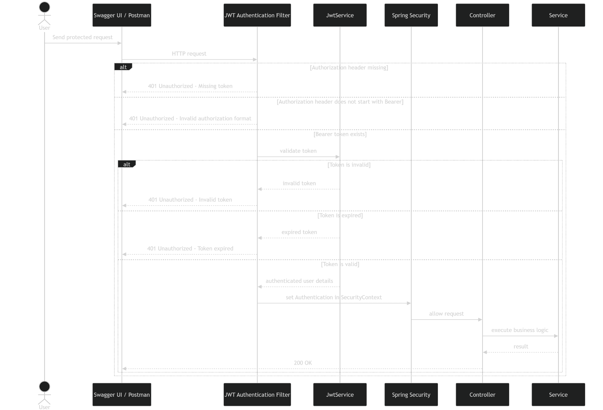
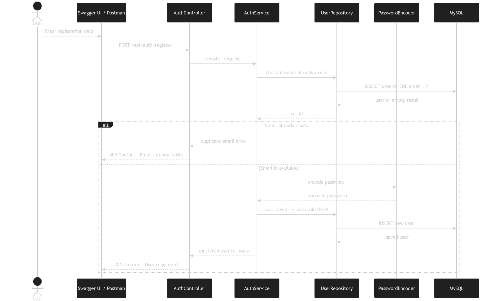
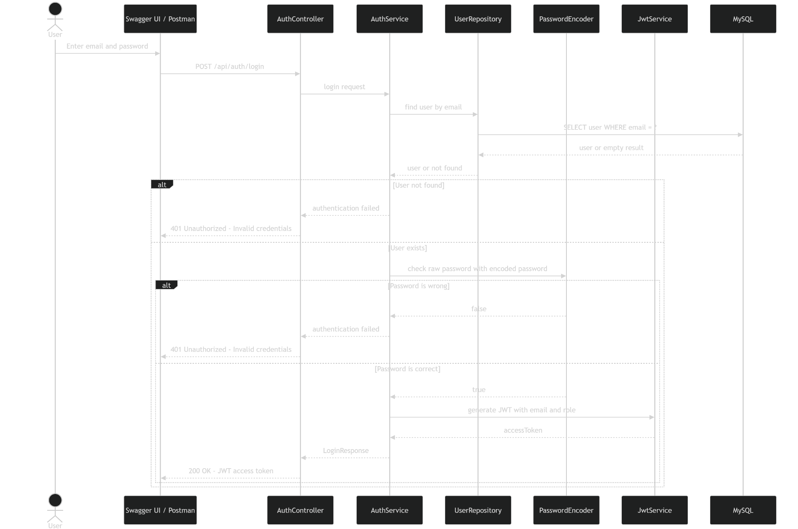

# Workgroup Final Project - Library REST API

Spring Boot REST API for managing library books and borrowings with JWT authentication and role-based authorization.

---

## Features

- Public user registration and login
- JWT stateless authentication
- Role-based authorization with `ADMIN` and `USER`
- Public book browsing
- Admin-only book create, update, and delete
- User borrowing management scoped to the authenticated user
- Admin access to all borrowings
- Swagger UI for API testing
- MySQL database support
- Global exception handling for common API errors

---

## Tech Stack

- Java 25
- Spring Boot 4
- Spring Web MVC
- Spring Data JPA
- Spring Security
- MySQL
- JWT with `io.jsonwebtoken`
- Springdoc OpenAPI / Swagger UI
- Maven

---

## Project Structure

```text
src/main/java/com/final_project/workgroup_final_project
+-- controllers
+-- exceptions
+-- models
|   +-- records
+-- repos
+-- services
+-- OpenApiConfig.java
+-- SecurityConfig.java
+-- WorkgroupFinalProjectApplication.java
```

---

## Architecture And API Diagrams

The following diagrams describe the main API architecture and request flows.  
They include both successful cases and common error cases, such as invalid credentials, duplicate email, missing JWT token, invalid JWT token, unauthorized access, book not found, unavailable book, and borrowing ownership violations.

> Put all diagram images inside:
>
> ```text
> docs/diagrams/
> ```
>
> Then keep the image links below exactly as they are.

---

### 1. Project Architecture Diagram

This diagram shows the general structure of the application: client, controllers, services, repositories, security layer, JWT service, and MySQL database.



---

### 2. Database ER Diagram

This diagram shows the database entities and relationships between users, books, and borrowings.



Main relationships:

- One `USER` can have many `BORROWING` records.
- One `BOOK` can appear in many `BORROWING` records.
- Each borrowing belongs to one authenticated user.
- Each borrowing references one book.

---

### 3. Global Error Handling Diagram

This diagram shows how API exceptions are converted into HTTP responses.



Common error responses:

| Status | Meaning |
|---|---|
| `400 Bad Request` | Invalid request body or validation error |
| `401 Unauthorized` | Missing token, invalid token, expired token, or invalid login |
| `403 Forbidden` | Authenticated user does not have permission |
| `404 Not Found` | Book or borrowing does not exist |
| `409 Conflict` | Duplicate email or unavailable book |
| `500 Internal Server Error` | Unexpected server error |

---

### 4. Create Borrowing Flow

This diagram shows the full flow for creating a borrowing, including error cases.



Handled cases:

- Token missing or invalid: `401 Unauthorized`
- Book does not exist: `404 Not Found`
- Book exists but is not available: `409 Conflict`
- Book exists and is available: borrowing is created and the book is marked unavailable

---

### 5. Borrowing Ownership Flow

This diagram shows how borrowing access is controlled depending on the authenticated user's role.



Authorization rules:

- `ADMIN` can access all borrowings.
- `USER` can access only their own borrowings.
- If a `USER` tries to access another user's borrowing, the API returns `403 Forbidden`.
- If the borrowing does not exist, the API returns `404 Not Found`.

---

### 6. Book Request Flow

This diagram shows public book browsing and admin-only book management.



Book access rules:

- `GET /api/books` is public.
- `GET /api/books/{id}` is public.
- `POST /api/books` requires `ADMIN`.
- `PUT /api/books/{id}` requires `ADMIN`.
- `DELETE /api/books/{id}` requires `ADMIN`.

Handled cases:

- Missing or invalid JWT on admin endpoints: `401 Unauthorized`
- Authenticated user is not admin: `403 Forbidden`
- Book does not exist: `404 Not Found`
- Successful book creation: `201 Created`
- Successful book update: `200 OK`
- Successful book deletion: `204 No Content`

---

### 7. JWT Protected Request Flow

This diagram shows how protected requests are authenticated before reaching the controller.



Handled cases:

- Authorization header missing
- Authorization header does not start with `Bearer`
- Token is invalid
- Token is expired
- Token is valid and the request continues to the controller

---

### 8. Registration Flow

This diagram shows the user registration process.



Handled cases:

- Email already exists: `409 Conflict`
- Email is available: password is encoded and the user is saved with role `USER`
- Successful registration: `201 Created`

---

### 9. Login Flow

This diagram shows the login process with correct and incorrect credentials.



Handled cases:

- User not found: `401 Unauthorized`
- Password is wrong: `401 Unauthorized`
- Password is correct: JWT access token is generated and returned

---

## Database

The local profile uses:

```properties
spring.datasource.url=jdbc:mysql://localhost:3306/masamune_ex
spring.datasource.username=root
spring.datasource.password=
spring.jpa.hibernate.ddl-auto=update
```

The app uses `data.sql` to insert initial book data.

---

## Profiles

The main file is:

```text
src/main/resources/application.properties
```

It activates the local profile:

```properties
spring.profiles.active=local
```

The local runtime config is:

```text
src/main/resources/application-local.properties
```

---

## Run The App

```powershell
.\mvnw.cmd spring-boot:run
```

The local profile currently uses:

```text
http://localhost:8080
```

You can force the local profile with:

```powershell
.\mvnw.cmd spring-boot:run "-Dspring-boot.run.profiles=local"
```

---

## Swagger UI

Open Swagger UI:

```text
http://localhost:8080/swagger-ui/index.html
```

OpenAPI JSON:

```text
http://localhost:8080/v3/api-docs
```

---

## Using JWT In Swagger

1. Register or login using `/api/auth/register` or `/api/auth/login`.
2. Copy the `accessToken` value.
3. Click **Authorize** in Swagger UI.
4. Paste the token as:

```text
Bearer YOUR_TOKEN_HERE
```

5. Click **Authorize**.

Protected endpoints will then use your JWT.

---

## Authentication Endpoints

| Method | Endpoint | Access |
|---|---|---|
| `POST` | `/api/auth/register` | Public |
| `POST` | `/api/auth/login` | Public |

Register creates a `USER` account by default.

---

## Book Endpoints

| Method | Endpoint | Access |
|---|---|---|
| `GET` | `/api/books` | Public |
| `GET` | `/api/books/{id}` | Public |
| `POST` | `/api/books` | `ADMIN` |
| `PUT` | `/api/books/{id}` | `ADMIN` |
| `DELETE` | `/api/books/{id}` | `ADMIN` |

Public users can explore books without logging in.

---

## Borrowing Endpoints

| Method | Endpoint | Access |
|---|---|---|
| `GET` | `/api/borrowings` | `USER` or `ADMIN` |
| `GET` | `/api/borrowings/{id}` | `USER` or `ADMIN` |
| `POST` | `/api/borrowings` | `USER` or `ADMIN` |
| `PUT` | `/api/borrowings/{id}` | `USER` or `ADMIN` |
| `DELETE` | `/api/borrowings/{id}` | `USER` or `ADMIN` |

Borrowing visibility rules:

- `ADMIN` can see and manage all borrowings.
- `USER` can see and manage only their own borrowings.
- New borrowings are linked automatically to the authenticated user from the JWT.

---

## Authorization Summary

| User Type | Permissions |
|---|---|
| Public user | Register, login, and browse books |
| `USER` | Browse books and manage only their own borrowings |
| `ADMIN` | Manage books and manage all borrowings |

---

## JWT Configuration

Configured in `application-local.properties`:

```properties
app.jwt.secret=${JWT_SECRET:change-this-secret-key-change-this-secret-key}
app.jwt.expiration-ms=${JWT_EXPIRATION_MS:86400000}
```

The JWT contains:

- Subject: user email
- Claim: `role`
- Expiration time

---

## Example Error Responses

### 401 Unauthorized

```json
{
  "status": 401,
  "error": "Unauthorized",
  "message": "Full authentication is required to access this resource"
}
```

### 403 Forbidden

```json
{
  "status": 403,
  "error": "Forbidden",
  "message": "You do not have permission to access this resource"
}
```

### 404 Not Found

```json
{
  "status": 404,
  "error": "Not Found",
  "message": "Book not found"
}
```

### 409 Conflict

```json
{
  "status": 409,
  "error": "Conflict",
  "message": "Email already exists"
}
```

---

## Run Tests

```powershell
.\mvnw.cmd test
```
